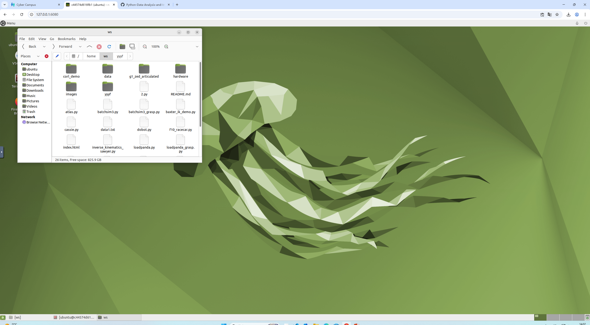
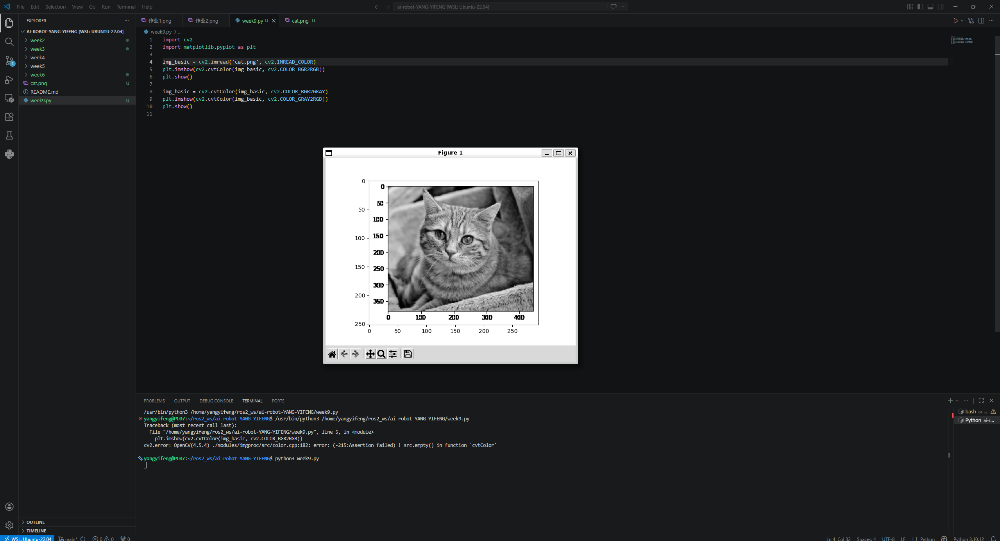
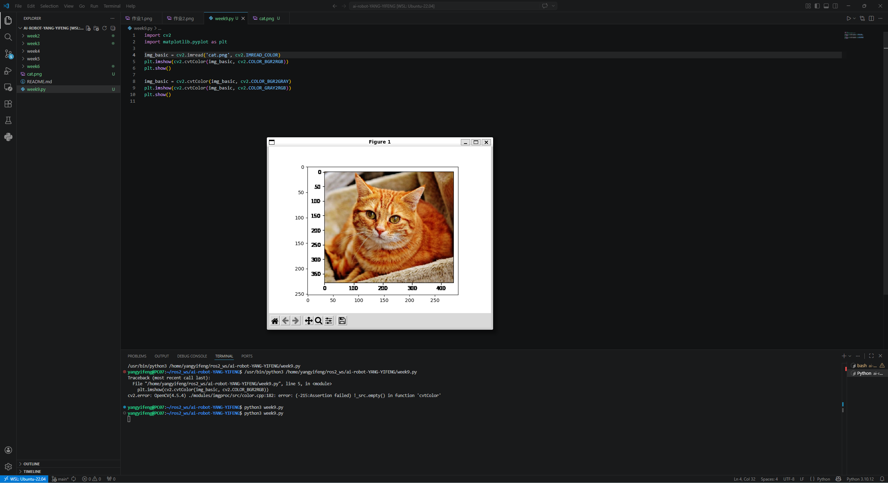

## 容器如何与本地文件交互  
使用 docker run -v 进行本地目录挂载  
docker run命令首先在指定的镜像上创建一个可写的容器层，然后使用指定的命令启动。（来源 docker.com）使用参数-v允许你绑定一个本地目录。  
 docker run -p 6080:80 --security-opt seccomp=unconfined --shm-size=512m  -v 当前目录$(pwd)/:/home/ws ghcr.io/tiryoh/ros2-desktop-vnc:humble  
  
# 安装opencv  
pip install opencv-python opencv-contrib-python  
在命令行里输入  
import cv2  
import matplotlib.pyplot as plt  

img_basic = cv2.imread('cat.jpg', cv2.IMREAD_COLOR)  
plt.imshow(cv2.cvtColor(img_basic, cv2.COLOR_BGR2RGB))  
plt.show()  

img_basic = cv2.cvtColor(img_basic, cv2.COLOR_BGR2GRAY)  
plt.imshow(cv2.cvtColor(img_basic, cv2.COLOR_GRAY2RGB))  
plt.show()  
  
  