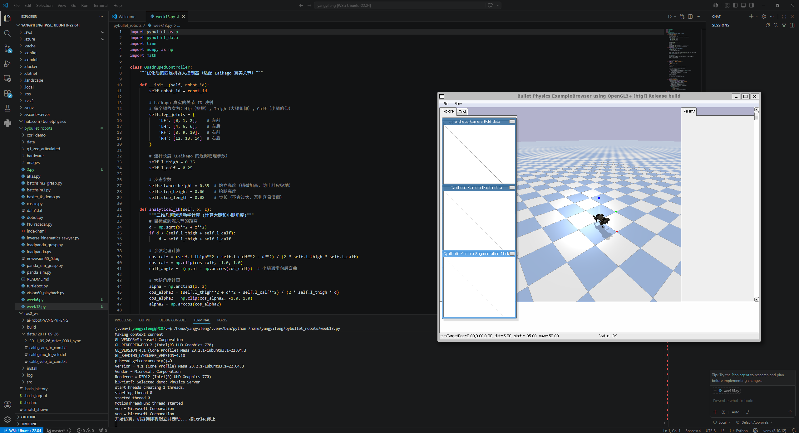

## 第13周：四足机器人入门  
- Trot步态实现  
- 主要针对机器狗在 PyBullet 仿真中无法起立、关节错位、运动轨迹不符合物理规律等问题进行了核心重构。  
1. 修正关节 ID 映射 (self.leg_joints)
修改代码: 适配了 PyBullet 中 Laikago 模型的真实结构。因为 Laikago 模型中包含了很多不参与控制的隐藏关节、传感器或脚趾，真实的控制关节 ID 应该是：  
左前腿 (LF): [0, 1, 2]  
左后腿 (LH): [4, 5, 6]  
右前腿 (RF): [8, 9, 10]  
右后腿 (RH): [12, 13, 14]  
2. 新增了一个独立的 analytical_ik 函数。通过输入目标足端的 $(x, z)$ 相对坐标，利用余弦定理和三角函数，高精度地反算出大腿（Thigh）和小腿（Calf）所需的真实物理旋转角度。  
3. 修正步态轨迹的方向与物理逻辑  
引入了明确的连杆长度参数（大腿和小腿各 0.25）。重新设计了轨迹：支撑相时足端保持在支撑高度（z = self.stance_height），同时 $x$ 轴向后推，利用反作用力驱动身体向前；摆动相时，足端沿正弦曲线抬起（减去 step_height）并向前摆动  
4. 增大电机驱动力 (force)  
将 force 提升到了 40，确保电机有足够的力矩支撑身体并完成迈步动作。  
5. 调整初始姿态与仿真参数  
在 main 函数循环中，将 controller.step(t, frequency=1.5) 调整为了更符合实际四足步态的 1.5Hz 频率，使机器狗的踏步和走动更加连贯、自然。  
  