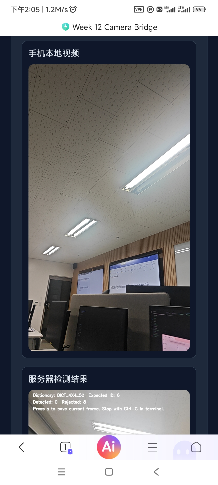

## 手机端视频方案：统一使用 HTML5 相机  
本周课堂统一采用：
手机浏览器
HTML5 摄像头
Tailscale
老师提供的 WSL 接收脚本  
第一步：先把网络打通  
在 WSL 中执行：  
sudo service tailscaled start  
tailscale status  
tailscale ip -4  
第二步：完成 SSH 学习测试  
在 WSL 中确保 SSH 服务已经装好并启动：  
sudo apt update  
sudo apt install openssh-server -y  
sudo service ssh start  
ss -tlnp | grep :22  
第三步：先安装本周需要的 Python 库  
在运行相机桥接程序之前，先安装本周需要的依赖。  
如果系统里还没有 pip3，先安装：  
sudo apt update  
sudo apt install python3-pip -y  
然后安装本周起始代码依赖：  
pip3 install -r week12_starters/requirements.txt  
第四步：运行老师提供的相机接收脚本  
接下来不要求学生先看懂服务端代码，而是先把脚本运行起来。  
例如：
python3 week12_starters/camera_bridge.py  
第五步：用手机浏览器访问页面  
在手机浏览器中打开：
htpps//100.73.187.84:5000  

