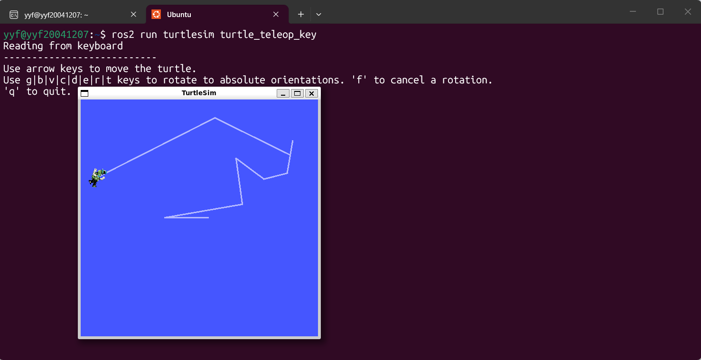
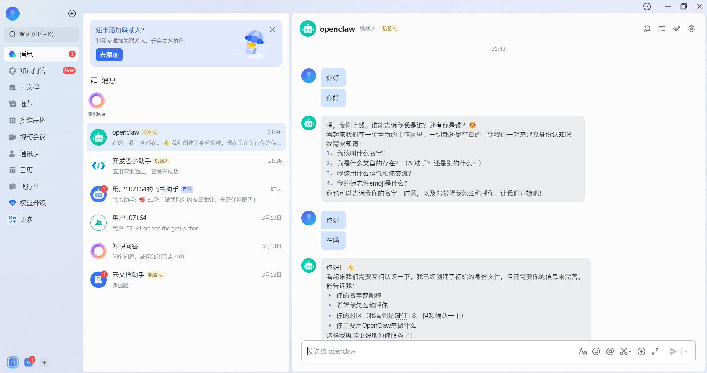

## week2 安装wsl ubuntu与安装openclaw龙虾并与飞书连接  运行小乌龟 
 # 1. 下载Ubuntu 22.04
https://ubuntu.com/download/desktop

# 2. 使用Rufus制作启动U盘
https://rufus.ie/

# 3. 安装Ubuntu

# 4. 安装ROS2
sudo apt update 
sudo apt install ros-humble-desktop 
2.2.5 验证ROS2安装
# 启动小乌龟
ros2 run turtlesim turtlesim_node

# 另一个终端启动控制
ros2 run turtlesim turtle_teleop_key 
- 
openclaw与飞书连接 
- 