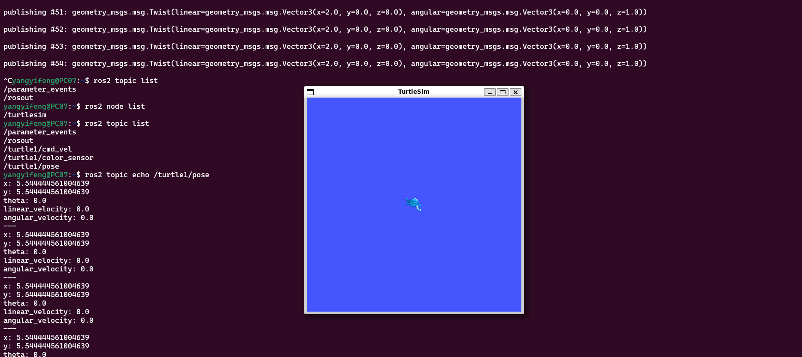
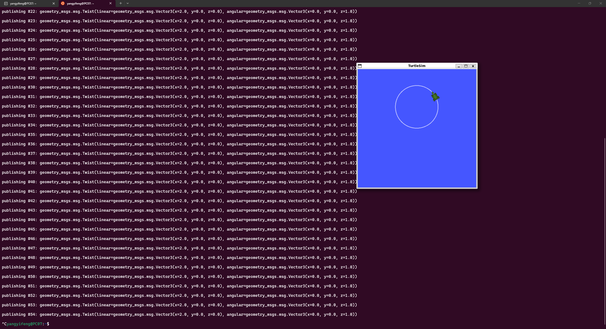
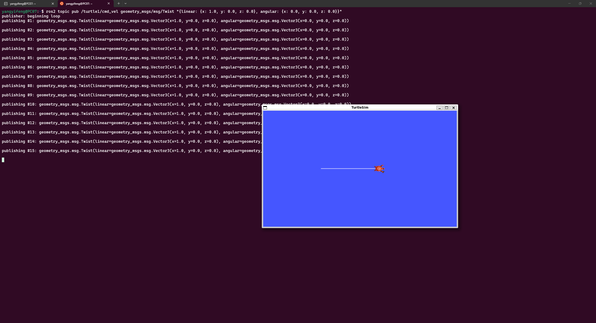
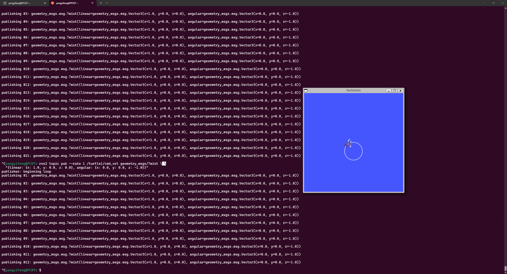

## Week3 ROS2基本命令介绍和通信机制基础  
监听话题
# 监听话题消息
ros2 topic echo <话题名>

# 示例：监听小乌龟位置
ros2 topic echo /turtle1/pose 
  
- 实验1：基础画圆
# 让小乌龟画圆（前进 + 左转）
ros2 topic pub --rate 1 /turtle1/cmd_vel geometry_msgs/Twist \ 
  "{linear: {x: 2.0, y: 0.0, z: 0.0}, angular: {x: 0.0, y: 0.0, z: 1.0}}"  
  
- 试验2：前进命令  
# 让小乌龟前进
ros2 topic pub <话题> <消息类型> <数据>  
ros2 topic pub /turtle1/cmd_vel geometry_msgs/Twist \
  "{linear: {x: 1.0, y: 0.0, z: 0.0}, angular: {x: 0.0, y: 0.0, z: 0.0}}"  
  
- 实验3：顺时针画圆
# 顺时针转
ros2 topic pub --rate 1 /turtle1/cmd_vel geometry_msgs/Twist \
  "{linear: {x: 1.0, y: 0.0, z: 0.0}, angular: {x: 0.0, y: 0.0, z: -1.0}}"  
  