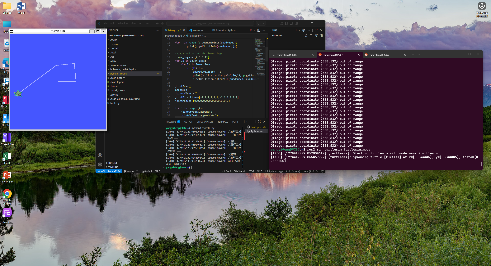
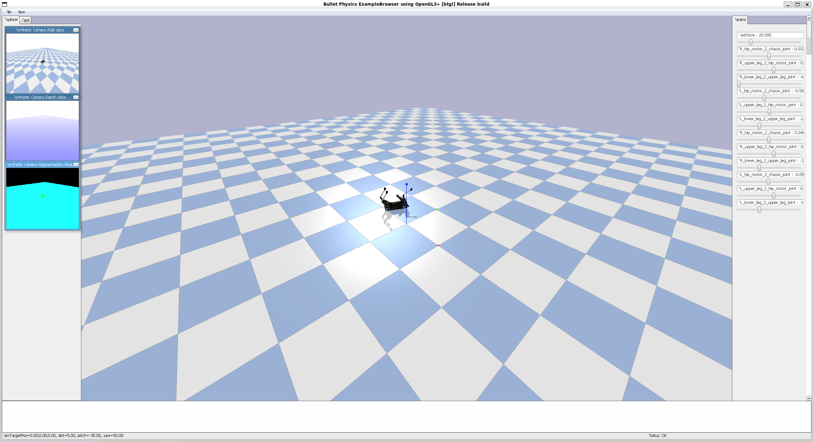

## week4 机器人运动学基础（二维）  
# 小乌龟走正方形原理  
#!/usr/bin/env python3
"""
让小乌龟走正方形的控制脚本
"""

import rclpy
from rclpy.node import Node
from geometry_msgs.msg import Twist
import time

class SquareMover(Node):
    """走正方形的控制节点"""

    def __init__(self):
        super().__init__('square_mover')

        # 创建发布者
        self.cmd_vel_pub = self.create_publisher(
            Twist, 
            '/turtle1/cmd_vel', 
            10
        )

        # ============ 参数设置 ============
        self.SPEED = 1.0              # 线速度 m/s
        self.TURN_SPEED = 1.0          # 角速度 rad/s
        self.SIDE_LENGTH = 2.0         # 边长 m

        # 计算运动时间
        self.MOVE_TIME = self.SIDE_LENGTH / self.SPEED
        self.TURN_TIME = 1.5708 / self.TURN_SPEED  # 90° = π/2

        self.get_logger().info('🎯 正方形控制节点启动！')
        self.get_logger().info(f'📐 边长: {self.SIDE_LENGTH}m, 速度: {self.SPEED}m/s')

    def move_straight(self, duration):
        """直行指定时间"""
        self.get_logger().info('→ 直行...')

        msg = Twist()
        msg.linear.x = float(self.SPEED)
        msg.angular.z = 0.0

        # 记录开始时间
        start_time = self.get_clock().now()

        # 持续发布命令
        while (self.get_clock().now() - start_time).nanoseconds < duration * 1e9:
            self.cmd_vel_pub.publish(msg)
            time.sleep(0.01)

        # 停止
        self.stop()
        self.get_logger().info('✓ 直行完成')

    def turn(self, duration):
        """旋转指定时间"""
        self.get_logger().info('↻ 旋转...')

        msg = Twist()
        msg.linear.x = 0.0
        msg.angular.z = float(self.TURN_SPEED)

        start_time = self.get_clock().now()

        while (self.get_clock().now() - start_time).nanoseconds < duration * 1e9:
            self.cmd_vel_pub.publish(msg)
            time.sleep(0.01)

        self.stop()
        self.get_logger().info('✓ 旋转完成')

    def stop(self):
        """停止运动"""
        msg = Twist()
        msg.linear.x = 0.0
        msg.angular.z = 0.0
        self.cmd_vel_pub.publish(msg)
        time.sleep(0.1)

    def move_square(self):
        """执行走正方形"""
        self.get_logger().info('🏁 开始走正方形！')

        for i in range(4):
            self.get_logger().info(f'━━━ 第 {i+1}/4 条边 ━━━')
            self.move_straight(self.MOVE_TIME)

            self.get_logger().info(f'━━━ 第 {i+1}/4 次转弯 ━━━')
            self.turn(self.TURN_TIME)

        self.get_logger().info('🎉 正方形走完！回到起点！')

def main(args=None):
    rclpy.init(args=args)
    node = SquareMover()

    # 给系统一点准备时间
    time.sleep(1)

    # 执行走正方形
    node.move_square()

    node.destroy_node()
    rclpy.shutdown()
if __name__ == '__main__':
    main()
  
# 机器狗放倒  
- python安装和python程序的命令行执行  
sudo apt install python  
cd 程序所在目录  
python3 程序名字.py (有时候需要用python)  
python 的包管理器 pip (有时候需要使用pip3) 安装  
sudo apt install python3-pip  
pip3 install pybullet 安装仿真用的物理引擎库  
- 运行机器狗仿真程序  
#git clone https://github.com/bulletphysics/pybullet_robots  
#python3 lakago.py  
- 运行程序，改关节参数，放（倒）狗（子）
