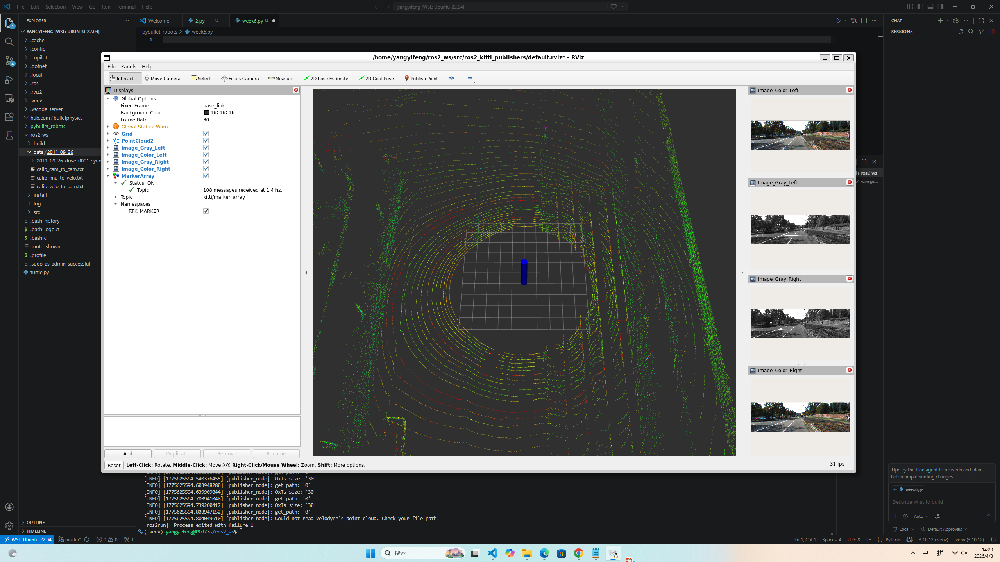
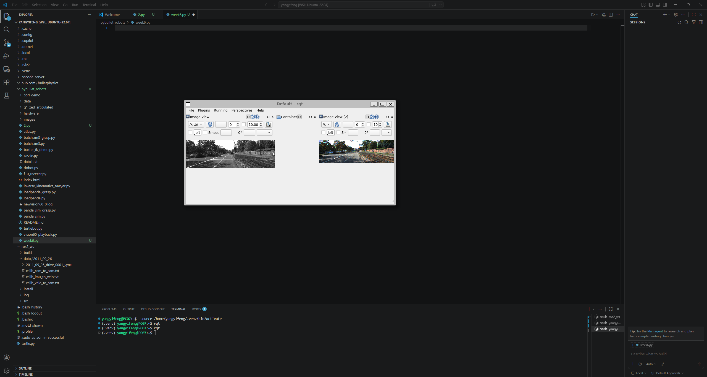

## week6 ROS2 Kitti 数据集发布器 (Publishers)  
- 这是一个示例 ROS2 发布器应用程序，用于将 Kitti 数据集转换并发布为 ROS2 消息。 发布的消息主要包括 PointCloud2（点云）、Image（图像）、Imu（惯性测量单元）和 MarkerArray（标记阵列）。  
- mkdir -p ~/ros2_ws/src  
- cd ~/ros2_ws/src  
- git clone https://github.com/ai-robot-class/ros2_kitti_publishers.git  
- Kitti 示例数据地址 https://drive.google.com/file/d/1lCOOkoUp1RRrFhUwRVNVwRWIclv-etBu/view?usp=drive_link  
- 数据保存路径 ~/ros2_ws/data  
week2
- 
 ├── data 
│   └── 2011_09_26 
│       ├── 2011_09_26_drive_0001_sync 
│       │   ├── image_00 
│       │   │   ├── data 
│       │   │   │   ├── 0000000000.png 
│       │   │   │   ├── 0000000001.png 

- 终端运行 
d ~/ros2_ws 
colcon build --cmake-clean-cache 
source ./install/setup.bash 
ros2 run ros2_kitti_publishers kitti_publishers 
另一个终端运行 
ros2 daemon start 
rviz2 
week2
- 
第三个终端运行
- rqt