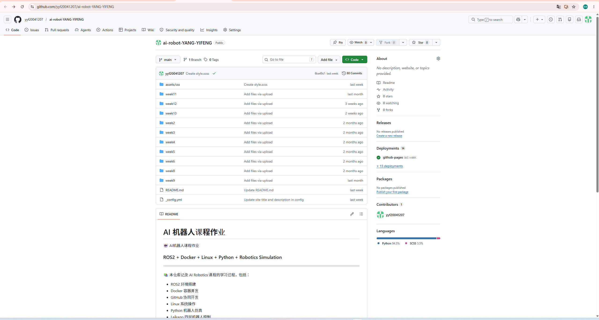

## week7 GitHub 仓库整理  
1. 整理仓库规则  
每周一个文件夹，例如 week7/README.md。  
图片统一放在 img/week7/，并使用相对路径引用。  
首页 README.md 放课程目录和个人信息。  
每周报告包含目标、步骤、结果、问题和总结  

2. Markdown的常用格式：  
2.1  项目标题  
# AI Robot Course Project
规则：  
一级标题只能有一个  
使用项目名称  
尽量简短  
2.2 项目简介（Description）  
## Description

This project is a learning project for ROS2, Docker and GitHub.
The purpose is to understand robot simulation and software development workflow.
规则：  
说明项目是干什么的  
2~5句话即可  
不要写太长  
2.3 项目功能（Features）  
## Features

- ROS2 Robot Simulation
- Docker Environment
- GitHub Version Control
- Autonomous Navigation
规则：  
使用列表  
每个功能单独一行  
简洁描述  
2.4 截图展示（Screenshots）
## Screenshots  
  
规则：  
图片放在 images 文件夹  
使用相对路径  
3. 仓库样式  
