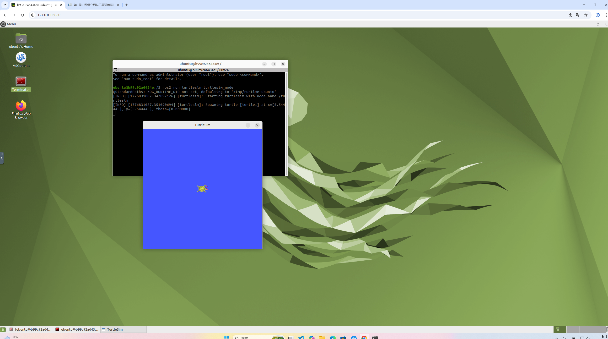

## Week8docker-ros2-desktop-vnc  
打开 Windows docker 网站进行下载  
在c盘中把ProgramData里面的dockers文件删了  
在管理员命令中把docker的地址放入进行下载  
重启电脑后在管理员命令中放入docker run -p 6080:80 --security-opt seccomp=unconfined --shm-size=512m ghcr.io/tiryoh/ros2-desktop-vnc:humble  
下载完后进入http://127.0.0.1:6080/.  
打开Terminator输入ros2 run turtlesim turtlesim_node  

